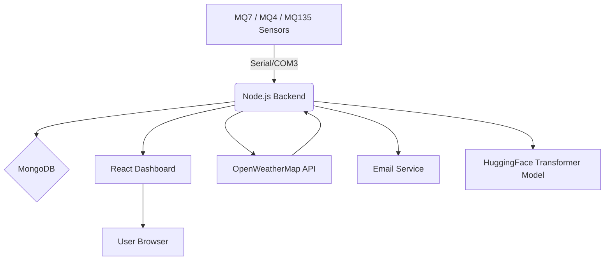

# 🌬️ Air Quality Monitoring System

[](https://opensource.org/licenses/MIT)
[](https://react.dev/)
[](https://nodejs.org/)

A full-stack IoT-based Air Quality Monitoring System using **Arduino**, **Node.js/Express**, **MongoDB**, and a **React** frontend. It integrates local gas sensors and external weather APIs to calculate real-time AQI, issue health alerts, and visualize environmental conditions. Future-ready with predictive analytics using transformer models.


---

## ✨ Features

- 📊 Real-time sensor data visualization (CO, Methane, Air Quality)
- 🌦️ Integration with OpenWeatherMap for PM2.5, PM10, humidity, temperature, etc.
- ⚠️ Threshold-based email alerts with health tips
- 📈 Historical air quality trends (CSV + DB)
- 🔮 Future AQI prediction with HuggingFace time-series transformer (planned)
- 📨 Email subscription system
- 🖥️ Full-stack MERN implementation
- 🔒 Environment variable protection for keys & services

---

## 🧠 System Architecture



---

## 🛠️ Hardware Used

- **Arduino Mega 2560**
- **MQ-7** – Carbon Monoxide sensor
- **MQ-4** – Methane sensor
- **MQ-135** – General air quality sensor
- USB cable, breadboard, resistors  
> **Note:** OLED display was planned but not used in the final version.

---

## 💻 Software & Tools

- **Frontend:** React + TypeScript + TailwindCSS + Vite
- **Backend:** Node.js + Express + SerialPort
- **Database:** MongoDB Atlas
- **Data Source:** OpenWeatherMap API
- **Email Service:** NodeMailer
- **Prediction (Planned):** HuggingFace Transformers (Time Series Forecasting)

---

## ⚙️ Installation & Setup

### 🔌 Backend Setup

```bash
git clone https://github.com/yourusername/air-quality-system.git
cd air-quality-system/backend
npm install
cp .env.example .env  # then add your credentials
npm start
```

### 🧾 Required `.env` Variables

```env
PORT=5001
MONGODB_URI=your_mongodb_connection
OPENWEATHERMAP_API_KEY=your_api_key
EMAIL_USER=your_email@gmail.com
EMAIL_PASS=your_password
CITY_NAME=Chittagong,BD
```

---

### 🖼️ Frontend Setup

```bash
cd ../
npm install
npm run dev
```

Visit: `http://localhost:5173`

---

### 🔁 Arduino Setup

- Upload the `arduinoCode.cpp` from `/Arduino_Code` using Arduino IDE.
- Libraries:
  - Adafruit SSD1306 *(optional)*
  - Adafruit GFX
- Connect via Serial (COM3/ttyUSB) at 9600 baud.

---

## 🧪 API Documentation

### 📡 Sensor API

- `POST /api/sensors/upload`
- `GET /api/sensors/latest`

### 🌦 Weather API

- `GET /api/weather`
- `GET /api/weather/historical`

### 📧 Email Alerts

- `POST /api/alerts/subscribe`
- `POST /api/alerts/unsubscribe`
- `GET /api/alerts/test-alert`

### 🔮 AQI Prediction

- `GET /api/predictions` *(planned)*

📚 Full API Reference: [API_DOCUMENTATION.md](./API_DOCUMENTATION.md)

---

## 🗃️ Database Schema

### `SensorData`

```json
{
  "co": 0.3,
  "methane": 2.4,
  "airQuality": 450,
  "pm25": 78,
  "pm10": 110,
  "temperature": 30.5,
  "humidity": 65,
  "aqi": 134,
  "timestamp": "2025-04-15T14:00:00Z"
}
```

### `EmailSubscription`

```json
{
  "email": "user@example.com",
  "aqiThreshold": 150,
  "subscribedAt": "2025-04-10T10:00:00Z"
}
```

---

## 🧠 AI-Powered Prediction (Planned)

- Uses past 2 years of PM2.5, O₃, and current API data
- Transformer-based sequence modeling
- Output: Next 24-hour AQI trend prediction
- Status: 🔄 In progress

---

## 🔧 Troubleshooting

### Sensor Not Working?
- Ensure correct COM port is selected
- Use `Serial Monitor` to test Arduino output
- Check wiring and sensor warm-up

### Emails Not Sending?
- Validate email/password in `.env`
- Check spam folder
- Verify NodeMailer config

---

## 🙌 Contributing

1. Fork the repo
2. Create a feature branch:
   ```bash
   git checkout -b feature/my-new-feature
   ```
3. Push changes and open a PR

---

## 📝 License

This project is licensed under the [MIT License](LICENSE).

---

## 🙏 Acknowledgments

- [OpenWeatherMap](https://openweathermap.org/)
- [HuggingFace](https://huggingface.co/)
- [Adafruit Libraries](https://github.com/adafruit)
- [EPA AQI Standards](https://www.airnow.gov/aqi/aqi-basics/)

---

## 👨‍💻 Maintainers

**Arijit Roy**  
**Ittekhar Mahin Abir**  
**Raheta Sadeka**

📘 *CSE 342 – IoT Based Project Development*  
📍 *East Delta University, Chattogram, Bangladesh*

